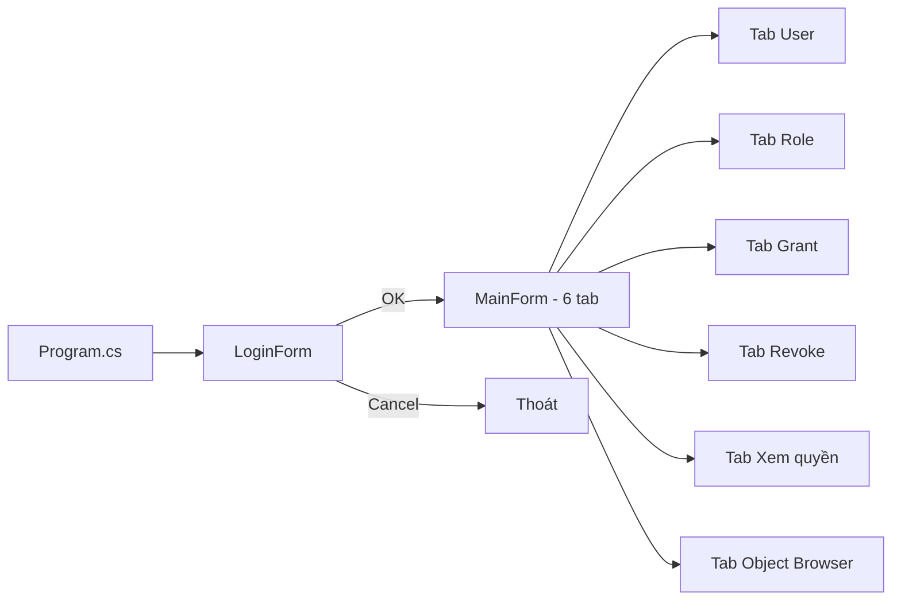

# NHOM 09 — Hướng dẫn sử dụng ứng dụng Quản trị Oracle (WinForms)

Tài liệu mô tả cách chạy, đăng nhập, và sử dụng ứng dụng **NHOM09.exe** để quản trị **User/Role/Privilege** trên Oracle.

Phiên bản hiện tại dùng **một cửa sổ chính `MainForm`** với **6 tab**:

1. **User**
2. **Role**
3. **Grant**
4. **Revoke**
5. **Xem quyền**
6. **Object Browser**

---

## 1. Yêu cầu trước khi dùng

### 1.1. Môi trường

- Windows + .NET Framework **4.7.2**
- Oracle Database đang chạy (ví dụ port `1521`)
- Tài khoản Oracle đủ quyền đọc các view **`DBA_*`** và thực thi DDL/DCL cần thiết

### 1.2. Khuyến nghị quyền (môi trường lab)

Trong bài thực hành, thường dùng `SYS` + **SYSDBA** để:

- đọc `DBA_USERS`, `DBA_ROLES`, `DBA_*_PRIVS`, `DBA_OBJECTS`, `DBA_TABLES`, `DBA_VIEWS`, `DBA_TAB_COLUMNS`
- chạy `CREATE USER`, `ALTER USER`, `DROP USER`, `CREATE ROLE`, `DROP ROLE`, `GRANT`, `REVOKE`

---

## 2. Chạy ứng dụng

1. Build project trong Visual Studio.
2. Chạy `NHOM09.exe` trong:
   - `WindowsFormsApp1\\bin\\Debug\\NHOM09.exe` hoặc
   - `WindowsFormsApp1\\bin\\Release\\NHOM09.exe`

### 2.1. Dữ liệu mẫu để demo nhanh (khuyến nghị)

Để demo đủ 6 tab, bạn có thể dùng bộ ví dụ sau (tùy DB có schema HR hay không):

- **User demo**: `U_TEST`
- **Password demo**: `P@ssw0rd_123` (nếu DB có policy mạnh có thể cần password khác)
- **Role demo**: `R_TEST`
- **Object demo**: `HR.EMPLOYEES` (nếu không có schema HR, chọn 1 bảng khác trong Tab Object Browser)

---

## 3. Màn hình đăng nhập (LoginForm)

### 3.1. Nhập thông tin

- **Máy chủ (Host)**: ví dụ `localhost`
- **Port**: thường `1521`
- **Service/PDB**: ví dụ `XEPDB1`
- **Tài khoản / Mật khẩu**
- **Đăng nhập SYSDBA**: tick nếu cần quyền SYSDBA trong lab

### 3.2. Bấm “Kết nối”

- Ứng dụng tạo connection string và test bằng `OracleConnection.Open()`.
- Thành công: vào **`MainForm`** (6 tab).
- Thất bại: hiện MessageBox lỗi Oracle/mạng.

**Lưu ý bảo mật:** không commit mật khẩu thật vào Git (App.config chỉ nên là ví dụ).

### 3.3. Ví dụ đăng nhập (để chụp hình báo cáo)

- **Host**: `localhost`
- **Port**: `1521`
- **Service/PDB**: `XEPDB1`
- **User**: `sys`
- **Password**: (mật khẩu SYS của bạn)
- **SYSDBA**: tick
- Bấm **Kết nối**

Kết quả mong đợi:

- Không báo lỗi → mở cửa sổ chính `MainForm` với 6 tab.
- Nếu báo lỗi: ghi lại mã ORA-... để đưa vào phần “Lỗi thường gặp”.

---

## 4. Luồng hoạt động tổng thể



Mọi thao tác (Query/Execute) đều gửi SQL trực tiếp đến Oracle và hiển thị DataTable lên lưới.

### 4.1. Ứng dụng thực thi gì ở phía Oracle?

Bạn có thể hiểu đơn giản:

- Nút **Refresh/Browse/Xem** → chạy **SELECT** vào các view `DBA_*`
- Nút **Thêm/Sửa/Xóa/Grant/Revoke** → chạy lệnh **DDL/DCL** như:
  - `CREATE USER`, `ALTER USER`, `DROP USER`
  - `CREATE ROLE`, `DROP ROLE`
  - `GRANT ...`, `REVOKE ...`

---

## 5. Tab 1 — User

### 5.1. Mục tiêu

- Xem danh sách user trong DB.
- Tạo user.
- Đổi mật khẩu user.
- Khóa/Mở khóa user (qua combobox **Account status**).
- Xóa user.

### 5.2. Cách dùng nhanh

- **Refresh**: tải danh sách user lên lưới.
- **Thêm**
  - nhập `Username` + `Password` → bấm **Thêm**
- **Sửa**
  - chọn 1 dòng trên lưới (username sẽ được điền lại)
  - nếu nhập `Password` → sẽ đổi mật khẩu
  - chọn `Account status`:
    - `OPEN` = mở khóa
    - `LOCKED` = khóa
  - bấm **Sửa**
- **Xóa**
  - chọn user → bấm **Xóa**
  - ứng dụng dùng `DROP USER ... CASCADE` (cần cân nhắc vì có thể mất object)

### 5.3. Ví dụ chi tiết

#### Ví dụ 1: Tạo user `U_TEST`

1. Vào tab **User**
2. Bấm **Refresh** để thấy danh sách hiện tại
3. Nhập:
   - **Username**: `U_TEST`
   - **Password**: `P@ssw0rd_123`
4. Bấm **Thêm**
5. Bấm **Refresh** lại để kiểm tra user xuất hiện trên lưới

SQL tương ứng (khái niệm):

```sql
CREATE USER "U_TEST" IDENTIFIED BY "P@ssw0rd_123";
```

Kết quả mong đợi:

- Lưới có dòng `U_TEST`
- `ACCOUNT_STATUS` thường là `OPEN` (tùy DB)

#### Ví dụ 2: Đổi mật khẩu + khóa tài khoản

1. Chọn dòng `U_TEST` trên lưới (ứng dụng sẽ điền lại username)
2. Nhập **Password** mới, ví dụ: `P@ssw0rd_456`
3. Chọn **Account status = LOCKED**
4. Bấm **Sửa**
5. Bấm **Refresh** để kiểm tra

SQL tương ứng:

```sql
ALTER USER "U_TEST" IDENTIFIED BY "P@ssw0rd_456";
ALTER USER "U_TEST" ACCOUNT LOCK;
```

#### Ví dụ 3: Mở khóa tài khoản

1. Chọn `U_TEST`
2. Chọn **Account status = OPEN**
3. Bấm **Sửa**

SQL tương ứng:

```sql
ALTER USER "U_TEST" ACCOUNT UNLOCK;
```

#### Ví dụ 4: Xóa user (cẩn thận)

1. Chọn `U_TEST`
2. Bấm **Xóa**
3. Xác nhận hộp thoại cảnh báo

SQL tương ứng:

```sql
DROP USER "U_TEST" CASCADE;
```

---

## 6. Tab 2 — Role

### 6.1. Mục tiêu

- Xem danh sách role.
- Tạo role (có/không có password).
- Xóa role.

### 6.2. Cách dùng nhanh

- **Refresh**: tải danh sách role.
- **Thêm**
  - nhập `Role name`
  - nếu là password role: tick **Password role** và nhập password
  - bấm **Thêm**
- **Xóa**
  - chọn role từ lưới (role name được điền lại) → bấm **Xóa**

Ghi chú: Oracle không “đổi tên role” như user; nếu bài yêu cầu “Sửa role” thường sẽ là đổi password role hoặc drop+create theo quy ước bài lab.

### 6.3. Ví dụ chi tiết

#### Ví dụ 1: Tạo role thường `R_TEST`

1. Vào tab **Role**
2. Bấm **Refresh**
3. Nhập **Role name**: `R_TEST`
4. Bỏ tick **Password role**
5. Bấm **Thêm**
6. Bấm **Refresh** để kiểm tra

SQL tương ứng:

```sql
CREATE ROLE "R_TEST";
```

#### Ví dụ 2: Tạo password role `R_TEST_PWD`

1. Nhập **Role name**: `R_TEST_PWD`
2. Tick **Password role**
3. Nhập password, ví dụ `RolePwd_123`
4. Bấm **Thêm**

SQL tương ứng:

```sql
CREATE ROLE "R_TEST_PWD" IDENTIFIED BY "RolePwd_123";
```

#### Ví dụ 3: Xóa role

1. Chọn role trên lưới
2. Bấm **Xóa**

SQL tương ứng:

```sql
DROP ROLE "R_TEST";
```

---

## 7. Tab 3 — Grant

### 7.1. Chuẩn bị chung

- Bấm **Load users/roles** để nạp danh sách grantee.
- Chọn **Grantee** (user/role nhận quyền).

**Lưu ý:** từ phiên bản mới, app đã **xổ danh sách quyền/role** để chọn thay vì phải gõ:

- System privileges: lấy từ `SYSTEM_PRIVILEGE_MAP`
- Roles: lấy từ `DBA_ROLES`
- Object privileges: tự đổi theo object type (TABLE/VIEW vs PROCEDURE/FUNCTION)

### 7.2. Grant system privilege

- Nhập system privilege (ví dụ: `CREATE SESSION`)
- Tick `WITH ADMIN OPTION` nếu cần
- Bấm **Grant system priv**

#### Ví dụ: cấp `CREATE SESSION` cho `U_TEST`

1. Chọn **Grantee = U_TEST**
2. Ở nhóm **Grant system privilege**, chọn `CREATE SESSION`
3. (tuỳ chọn) tick `WITH ADMIN OPTION`
4. Bấm **Grant system priv**

SQL tương ứng:

```sql
GRANT CREATE SESSION TO "U_TEST";
```

### 7.3. Grant role

- Nhập role (ví dụ: `CONNECT`)
- Tick `WITH ADMIN OPTION` nếu cần
- Bấm **Grant role**

#### Ví dụ: cấp role `CONNECT` cho `U_TEST`

1. Chọn **Grantee = U_TEST**
2. Ở nhóm **Grant role**, chọn `CONNECT`
3. (tuỳ chọn) tick `WITH ADMIN OPTION`
4. Bấm **Grant role**

SQL tương ứng:

```sql
GRANT "CONNECT" TO "U_TEST";
```

### 7.4. Grant object privilege

- Nhập:
  - `Privilege`: `SELECT` / `UPDATE` / `INSERT` / `DELETE` / `EXECUTE` ...
  - `Object (OWNER.OBJECT)`: ví dụ `HR.EMPLOYEES`
  - `Columns (CSV)`: chỉ dùng khi `SELECT` hoặc `UPDATE` theo cột (ví dụ `SALARY, COMMISSION_PCT`)
- Tick `WITH GRANT OPTION` nếu cần
- Bấm **Grant object priv**

#### Ví dụ 1: cấp SELECT trên bảng `HR.EMPLOYEES` cho `U_TEST`

1. Chọn **Grantee = U_TEST**
2. Ở nhóm **Grant object privilege**:
   - **Object type**: `TABLE` (hoặc `VIEW` nếu là view)
   - **Privilege**: `SELECT`
   - **Object**: `HR.EMPLOYEES`
   - **Columns (CSV)**: để trống (cấp toàn bảng)
   - (tuỳ chọn) tick `WITH GRANT OPTION`
3. Bấm **Grant object priv**

SQL tương ứng:

```sql
GRANT SELECT ON HR.EMPLOYEES TO "U_TEST";
```

#### Ví dụ 2: cấp SELECT theo cột

Ví dụ chỉ cho xem 2 cột `SALARY, COMMISSION_PCT`:

1. Privilege = `SELECT`
2. Columns (CSV) = `SALARY, COMMISSION_PCT`
3. Bấm Grant

SQL tương ứng:

```sql
GRANT SELECT(SALARY, COMMISSION_PCT) ON HR.EMPLOYEES TO "U_TEST";
```

---

## 8. Tab 4 — Revoke

Cách dùng tương tự tab Grant:

1. **Load users/roles** → chọn **Grantee**
2. Chọn nhóm revoke tương ứng:

- **Revoke system privilege**: nhập sys priv → bấm **Revoke system priv**
- **Revoke role**: nhập role → bấm **Revoke role**
- **Revoke object privilege**:
  - nhập `Privilege`, `OWNER.OBJECT`
  - nếu revoke theo cột (SELECT/UPDATE) thì nhập `Columns (CSV)`
  - bấm **Revoke object priv**

### 8.1. Ví dụ chi tiết

#### Ví dụ 1: thu hồi `CREATE SESSION` từ `U_TEST`

1. Vào tab **Revoke**
2. Load users/roles → chọn **Grantee = U_TEST**
3. Chọn system privilege `CREATE SESSION`
4. Bấm **Revoke system priv**

SQL:

```sql
REVOKE CREATE SESSION FROM "U_TEST";
```

#### Ví dụ 2: thu hồi SELECT trên `HR.EMPLOYEES`

1. Grantee = `U_TEST`
2. Object type = `TABLE`
3. Privilege = `SELECT`
4. Object = `HR.EMPLOYEES`
5. Columns: để trống (thu hồi toàn quyền SELECT)
6. Bấm **Revoke object priv**

SQL:

```sql
REVOKE SELECT ON HR.EMPLOYEES FROM "U_TEST";
```

#### Ví dụ 3: thu hồi SELECT theo cột

1. Privilege = `SELECT`
2. Columns = `SALARY, COMMISSION_PCT`

SQL:

```sql
REVOKE SELECT(SALARY, COMMISSION_PCT) ON HR.EMPLOYEES FROM "U_TEST";
```

---

## 9. Tab 5 — Xem quyền

### 9.1. Mục tiêu

Nhập tên **user/role** và xem:

- System privileges
- Roles đã nhận
- Object privileges / Column privileges

### 9.2. Cách dùng

- Nhập `Tên` (khuyến nghị IN HOA theo Oracle dictionary)
- Chọn **User** hoặc **Role** (hiện query dựa theo grantee nên 2 lựa chọn này tương đương về mặt dữ liệu)
- Bấm **Xem**

### 9.3. Ví dụ chi tiết: xem quyền của `U_TEST`

1. Nhập **Tên**: `U_TEST`
2. Bấm **Xem**

Kết quả mong đợi:

- Grid **System privileges**: có `CREATE SESSION` (nếu bạn đã grant)
- Grid **Roles đã nhận**: có `CONNECT`/`R_TEST` (nếu đã grant)
- Grid **Object/Column privileges**: có `HR.EMPLOYEES` (nếu đã grant object priv)

---

## 10. Tab 6 — Object Browser

### 10.1. Mục tiêu

Duyệt object theo schema:

- chọn **Owner**
- chọn **Object type**: TABLE/VIEW/PROCEDURE/FUNCTION
- xem danh sách object
- nếu là TABLE/VIEW: xem columns

### 10.2. Cách dùng

- Bấm **Load owners** để nạp danh sách schema.
- Chọn owner và object type.
- Bấm **Browse** để tải danh sách object.
- Click chọn 1 object TABLE/VIEW để hiện columns ở lưới dưới.

### 10.3. Ví dụ chi tiết

#### Ví dụ: duyệt schema HR và xem cột bảng EMPLOYEES

1. Vào tab **Object Browser**
2. Bấm **Load owners**
3. Chọn **Owner = HR**
4. Chọn **Object type = TABLE**
5. Bấm **Browse**
6. Trên lưới Objects, chọn dòng `EMPLOYEES`
7. Lưới Columns phía dưới sẽ hiển thị các cột (COLUMN_NAME, DATA_TYPE, ...)

---

## 11. Lỗi thường gặp

| Hiện tượng | Gợi ý |
|---|---|
| Không kết nối được | kiểm tra host/port/service, DB có chạy, firewall |
| ORA-01031 (insufficient privileges) | dùng user đủ quyền đọc `DBA_*` và chạy DDL/DCL |
| ORA-00988 / lỗi password | password không hợp lệ theo profile/verify function |
| Grant/Revoke object lỗi | kiểm tra `OWNER.OBJECT` đúng, object tồn tại, quyền cấp phù hợp |

### 11.1. Một số lỗi Oracle hay gặp và cách giải thích (để viết báo cáo)

- **ORA-01031: insufficient privileges**  
  User đăng nhập không đủ quyền để đọc `DBA_*` hoặc không đủ quyền để `GRANT/REVOKE/CREATE USER`.  
  → Giải pháp: dùng user có quyền cao hơn (lab: SYSDBA) hoặc cấp quyền cần thiết.

- **ORA-00988: missing or invalid password(s)**  
  Password không đạt yêu cầu policy của DB.  
  → Giải pháp: đổi password theo policy (độ dài/ký tự/không trùng username…).

---

## 12. Lưu ý an toàn/bảo mật

- Chỉ dùng `SYS AS SYSDBA` trong môi trường lab/được phép.
- Không lưu mật khẩu thật vào file, ảnh chụp, hoặc Git.
- Cẩn thận với `DROP USER ... CASCADE` và `REVOKE` vì có thể ảnh hưởng bài demo.

---

## 13. Kịch bản demo gợi ý (end-to-end)

1. Đăng nhập (SYSDBA).
2. Tab **User**: Refresh → tạo user `U_TEST` → khóa/mở khóa thử.
3. Tab **Role**: tạo role `R_TEST` (tuỳ chọn password role).
4. Tab **Grant**:
   - Load users/roles
   - grant `CREATE SESSION` cho `U_TEST`
   - grant role `CONNECT` hoặc `R_TEST` cho `U_TEST`
   - (tuỳ chọn) grant `SELECT` trên `HR.EMPLOYEES`
5. Tab **Xem quyền**: nhập `U_TEST` → xem 3 grid.
6. Tab **Revoke**: revoke lại 1 quyền vừa cấp.
7. Tab **Object Browser**: browse schema `HR`, xem columns bảng.

### 13.1. Checklist chụp hình minh chứng (gợi ý)

- Ảnh 1: màn hình Login điền host/port/service + SYSDBA
- Ảnh 2: tab User tạo `U_TEST` thành công (lưới có dòng)
- Ảnh 3: tab Grant cấp `CREATE SESSION` / `CONNECT`
- Ảnh 4: tab Xem quyền thể hiện 3 grid có dữ liệu
- Ảnh 5: tab Revoke thu hồi một quyền và Xem quyền cập nhật lại
- Ảnh 6: tab Object Browser hiển thị columns của 1 bảng

---

*Tài liệu đi kèm project NHOM 09 — cập nhật theo giao diện `MainForm` (6 tab).*
